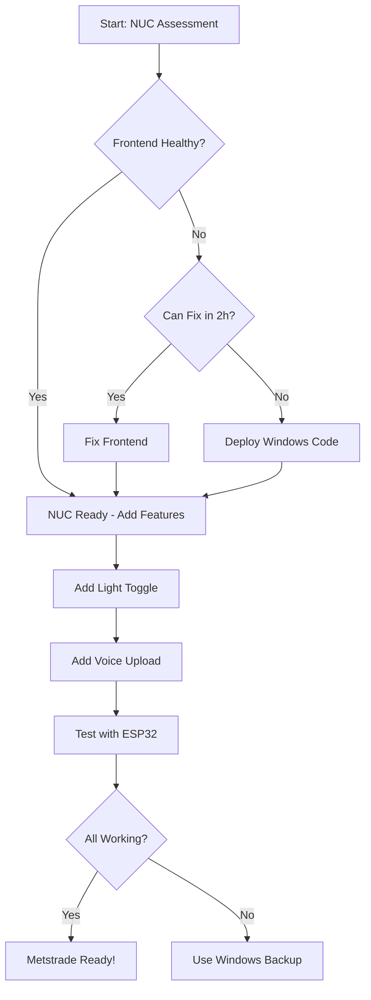

# 🎯 FINAL Metstrade Action Plan - 24 Hour Execution
**Created:** 2025-11-16 12:01 UTC
**Deadline:** 2025-11-17 ~12:00 UTC (24 hours)
**Target System:** NUC Linux (10.10.0.10) ONLY

---

## 📊 COMPLETE SYSTEM ASSESSMENT

### NUC Status (from NUC-STATUS-REPORT.md):
```
Location: /opt/obedio-yacht-crew-management/
Branch: deployment-fixes ✅
Backend: HEALTHY ✅ (port 3001)
Database: HEALTHY ✅ (PostgreSQL)
MQTT: HEALTHY ✅ (Mosquitto)
Frontend: UNHEALTHY ⚠️ (port 3000)
```

### Windows Status:
```
Branch: bmad (48 commits ahead)
Backend: Working ✅
Frontend: Working ✅
MQTT: Working ✅
Wear OS: Working ✅
Light Toggle: Probably here (not on NUC)
```

### Critical Gaps:
1. ❌ NUC Frontend unhealthy (cannot demo!)
2. ❌ Light toggle NOT on NUC (friend's feature missing)
3. ❌ `/api/upload-audio` endpoint missing on NUC
4. ❌ Voice-to-text incomplete (backend exists, upload missing)

---

## 🚨 CRITICAL ISSUE: Frontend Unhealthy on NUC

**This is BLOCKING for Metstrade!**
- You cannot demo without working frontend
- Backend alone is not enough
- Must fix FIRST before anything else

**Possible Causes:**
- Build failed during Docker deployment
- Environment variables missing
- Port conflict
- Dependencies not installed

---

## 🎯 EXECUTION STRATEGY

### **RECOMMENDATION: Hybrid Approach**

**Why:**
- NUC frontend broken (high risk)
- Light toggle missing on NUC
- Only 24 hours left
- Need working system guaranteed

**Plan:**
1. **Fix NUC frontend FIRST** (2h) - If successful → use NUC
2. **If NUC frontend won't fix** → Deploy Windows code to NUC (4h)
3. **Add voice + light features** (4h)
4. **Test everything** (2h)
5. **Backup: Bring Windows laptop** (insurance)

---

## 📋 DETAILED ACTION PLAN

### PHASE 1: FIX NUC FRONTEND (URGENT - 2 hours)

**Tasks:**
1. Check frontend container logs: `docker logs obedio-frontend`
2. Identify error (build failure? missing env? port issue?)
3. Fix based on error type:
   - Build fail → Rebuild with `docker-compose build frontend`
   - Env missing → Add to docker-compose
   - Port conflict → Change port mapping
4. Restart: `docker-compose restart frontend`
5. Test: `curl http://10.10.0.10:3000`

**Success Criteria:**
- ✅ Frontend container HEALTHY
- ✅ Can access http://10.10.0.10:3000
- ✅ Can login with admin/admin123

**If this fails after 2 hours → GO TO PHASE 2**

---

### PHASE 2: DEPLOY WINDOWS CODE TO NUC (Backup Plan - 4 hours)

**If frontend won't fix, deploy working Windows code:**

1. **On Windows:**
   ```bash
   git add .
   git commit -m "Working system with Wear OS - pre-Metstrade"
   git checkout deployment-fixes
   git merge bm ad --strategy-option theirs
   git push origin deployment-fixes
   ```

2. **On NUC:**
   ```bash
   cd /opt/obedio-yacht-crew-management
   git pull origin deployment-fixes
   docker-compose down
   docker-compose build --no-cache
   docker-compose up -d
   ```

3. **Wait 5 min, then test:**
   - http://10.10.0.10:3000 (frontend)
   - http://10.10.0.10:3001/api/health (backend)

**Success Criteria:**
- ✅ All containers HEALTHY
- ✅ Can login and use system

---

### PHASE 3: ADD LIGHT TOGGLE (1-2 hours)

**Option A: Friend's Code (if available)**
- Contact friend for light toggle code
- Add to `/opt/obedio-yacht-crew-management/backend/src/routes/`
- Test MQTT light control

**Option B: Recreate Feature (if friend unavailable)**
Create `/opt/obedio-yacht-crew-management/backend/src/routes/lights.ts`:
```typescript
// MQTT-controlled light toggle
POST /api/lights/toggle
{
  "deviceId": "light-001",
  "locationId": "location-uuid",
  "state": "on" | "off"
}
```

**Test:**
- MQTT message triggers light
- Can toggle from frontend
- Works reliably

---

###PHASE 4: COMPLETE VOICE-TO-TEXT (3-4 hours)

**Current State on NUC:**
- ✅ `/api/transcribe` exists (OpenAI Whisper)
- ❌ `/api/upload-audio` MISSING (ESP32 needs this!)

**Implementation:**
1. Add `/api/upload-audio` endpoint (I already started this in Windows)
2. Copy code to NUC deployment-fixes
3. Test with sample WAV file
4. Update ESP32 firmware for upload
5. Test end-to-end

**Files to modify on NUC:**
- `/opt/obedio-yacht-crew-management/backend/src/routes/upload.ts`
- Register route in `server.ts` (if not already)

---

### PHASE 5: ESP32 FIRMWARE & TESTING (2 hours)

**Hardware:**
1. Upload firmware to ESP32
2. Test button press → service request
3. Test voice recording → upload → transcription
4. Test light toggle
5. Verify Wear OS notifications

**Full Workflow Test:**
```
ESP32 Long Press → Record 30s
    ↓
Upload to NUC /api/upload-audio
    ↓
OpenAI Whisper transcription
    ↓
Service Request created
    ↓
Wear OS notification with transcript
    ↓
Crew accepts on watch
```

---

### PHASE 6: METSTRADE PREP (2 hours)

1. Create demo script (3 scenarios)
2. Test full workflow 3 times
3. Document known limitations
4. Prepare backup plan
5. Pack hardware
6. Create quick troubleshooting guide

---

## ⏰ TIME ALLOCATION

| Phase | Time | Priority | Fallback |
|-------|------|----------|----------|
| 1. Fix NUC Frontend | 2h | **CRITICAL** | Deploy Windows code |
| 2. Deploy Windows (if needed) | 4h | High | Use Windows laptop |
| 3. Light Toggle | 2h | **MUST-HAVE** | Demo with description |
| 4. Voice-to-Text | 4h | **MUST-HAVE** | Pre-recorded demo |
| 5. Hardware Testing | 2h | High | Virtual buttons |
| 6. Demo Prep | 2h | Medium | Minimal prep |
| **TOTAL** | **16h** | | |
| **Buffer** | 6h | | For sleep & issues |
| **Available** | 22h | | Until Metstrade |

**Verdict:** Achievable with focused execution!

---

## 🔄 DECISION TREE



---

## ✅ SUCCESS CRITERIA FOR METSTRADE

**Minimum Viable Demo:**
- [ ] NUC accessible at venue via Tailscale
- [ ] Frontend loads and login works
- [ ] ESP32 button creates service request
- [ ] Wear OS receives notification
- [ ] Light toggle works via MQTT
- [ ] Voice basic recording (with or without transcription)

**Target Demo:**
- [ ] Everything above PLUS:
- [ ] Full voice-to-text with OpenAI Whisper
- [ ] Multi-language transcription demo
- [ ] Real-time updates across all devices

**Stretch Goals:**
- [ ] Voice in 3 languages demonstrated
- [ ] Complete crew workflow shown
- [ ] Guest management features

---

## 🎯 IMMEDIATE NEXT STEPS

### 1. **Fix NUC Frontend (START NOW - 2h max)**
Contact Claude Code to:
- Get frontend container logs
- Identify error
- Fix and restart container
- Test http://10.10.0.10:3000

### 2. **Friend's Light Toggle (Parallel task)**
While frontend fixing:
- Ask friend for code location
- Is it committed to Git?
- Can we pull it?

### 3. **Voice Upload (After Frontend Fixed)**
- Add /api/upload-audio to NUC
- Test with curl/Postman
- Then integrate ESP32

---

## ❓ APPROVAL NEEDED

**This plan requires:**
1. Fixing N UC frontend (might take 2-4 hours)
2. Adding missing features (light, voice)
3. Coordinating with friend's code
4. Testing thoroughly

**Alternative - Safer but less ideal:**
- Perfect Windows system instead
- Bring Windows laptop to Metstrade
- Use NUC as backup only

**Which approach do you prefer?**