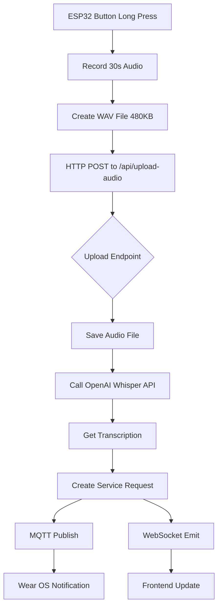

# 🎤 Voice-to-Text Implementation Plan for Metstrade
**Created:** 2025-11-16 11:18 UTC
**Deadline:** 24 hours
**Status:** ✅ System Stable - Ready to Add Voice Feature

---

## ✅ CURRENT STATUS (WORKING)

**What's Working:**
- ✅ Backend server running (port 8080)
- ✅ Frontend login (admin/admin123)
- ✅ Button simulator creating service requests
- ✅ Wear OS receiving real-time notifications
- ✅ MQTT communication
- ✅ WebSocket real-time updates
- ✅ Transcribe endpoint `/api/transcribe` (for manual testing)

**What's Missing:**
- ❌ `/api/upload-audio` endpoint (ESP32 needs this!)
- ❌ Integration between audio upload and service request creation
- ❌ ESP32 firmware upload logic (exists but endpoint missing)

---

## 🎯 OBJECTIVE

**Complete the voice workflow:**
```
ESP32 Records Voice (30s @ 8kHz)
    ↓
Upload WAV to /api/upload-audio
    ↓
Server: Save file + Call OpenAI Whisper
    ↓
Server: Get transcription + translation
    ↓
Server: Create Service Request with transcript
    ↓
Wear OS: Receive notification with voice notes
```

---

## 🏗️ ARCHITECTURE OVERVIEW



---

## 📋 IMPLEMENTATION TASKS (4 hours total)

### PHASE 1: Create Audio Upload Endpoint (1 hour)
**File:** `backend/src/routes/upload.ts`
**Tasks:**
1. Add new endpoint `POST /api/upload-audio`
2. Configure multer for audio files (WAV, WebM, MP3)
3. Save to `uploads/audio/` directory
4. Return JSON: `{ audioUrl, filename, duration }`
5. Test with Postman + sample WAV file

**Acceptance:** Upload WAV via Postman, get file URL back

---

### PHASE 2: Integrate Transcription (30 min)
**File:** `backend/src/routes/upload.ts`
**Tasks:**
1. Import OpenAI client from transcribe.ts logic
2. After file save, send to OpenAI Whisper
3. Get transcription + translation
4. Return in response: `{ audioUrl, transcript, translation, language }`
5. Test: Upload → Get transcription

**Acceptance:** Upload WAV, receive transcribed text

---

### PHASE 3: Auto-Create Service Request (30 min)
**Files:** `backend/src/routes/upload.ts`, MQTT service
**Tasks:**
1. Accept optional params: `deviceId`, `locationId`, `priority`
2. After transcription, create ServiceRequest with:
   - `requestType: 'voice'`
   - `voiceTranscript: transcript`
   - `notes: translation (if different language)`
3. Emit WebSocket event `service-request:created`
4. Publish MQTT to Wear OS watches

**Acceptance:** Upload → Service Request created → Wear OS notified

---

### PHASE 4: ESP32 Firmware Fix (1 hour)
**File:** `hardware/obedio-custom-pcb-simple/` (integrate from AUDIO_RECORDING_UPDATE.ino)
**Tasks:**
1. Add I2S microphone setup
2. Add audio recording function (30s @ 8kHz)
3. Fix HTTP upload:
   - URL: `http://10.10.0.207:8080/api/upload-audio`
   - Method: `POST`
   - Content-Type: `multipart/form-data`
   - Field name: `audio`
4. Add error handling + LED feedback
5. Test on real hardware

**Acceptance:** Press & hold button → Record → Upload → Service request created

---

### PHASE 5: End-to-End Testing (30 min)
**Tests:**
1. ✅ Manual: Postman upload WAV → transcription
2. ✅ ESP32: Long press → upload → transcription
3. ✅ Service request created with voice notes
4. ✅ Wear OS receives notification
5. ✅ Frontend shows service request
6. ✅ Battery voltage stable on ESP32

---

### PHASE 6: Metstrade Prep (1 hour)
**Tasks:**
1. Create demo scenarios (3 locations, 2 languages)
2. Test full system 3 times
3. Document known limitations
4. Clean up unnecessary files
5. Prepare backup plan if network fails
6. Print troubleshooting guide

---

## 🔧 TECHNICAL DETAILS

### Audio Format
```
Format: WAV (PCM 16-bit)
Sample Rate: 8000 Hz (8kHz)
Channels: Mono (1)
Duration: Max 30 seconds
File Size: ~480KB (30s × 8000 × 2 bytes)
```

### API Endpoint Spec
```typescript
POST /api/upload-audio
Content-Type: multipart/form-data

Fields:
- audio: File (required) - WAV/WebM audio file
- deviceId: string (optional) - ESP32 device ID
- locationId: string (optional) - Location UUID
- priority: string (optional) - normal/urgent/emergency

Response:
{
  success: true,
  data: {
    audioUrl: "/uploads/audio/recording-123.wav",
    filename: "recording-123.wav",
    transcript: "I need a coffee please",
    translation: "I need a coffee please",
    language: "en",
    duration: 3.5,
    serviceRequest: {
      id: "req-uuid",
      status: "pending",
      voiceTranscript: "I need a coffee please"
    }
  }
}
```

### ESP32 HTTP Request
```cpp
POST /api/upload-audio HTTP/1.1
Host: 10.10.0.207:8080
Content-Type: multipart/form-data; boundary=----WebKitFormBoundary
Content-Length: 480088

------WebKitFormBoundary
Content-Disposition: form-data; name="audio"; filename="recording.wav"
Content-Type: audio/wav

[WAV header 44 bytes]
[PCM audio data 480000 bytes]
------WebKitFormBoundary
Content-Disposition: form-data; name="deviceId"

BTN-A1B2C3D4E5F6
------WebKitFormBoundary--
```

---

## ⚠️ RISKS & MITIGATION

| Risk | Impact | Mitigation |
|------|--------|------------|
| ESP32 RAM overflow (480KB buffer) | High | Test on hardware, reduce to 15s if needed |
| HTTP upload timeout | Medium | Add retry logic, increase timeout to 30s |
| OpenAI API rate limit | Low | Use try-catch, fallback to "Voice message recorded" |
| WiFi unreliable at venue | High | Test with mobile hotspot, have backup demo |
| Battery voltage drop | Medium | Use external power for demo |

---

## 📊 TIME ESTIMATE

| Phase | Time | Priority |
|-------|------|----------|
| Audio upload endpoint | 1h | Critical |
| Transcription integration | 30min | Critical |
| Service request creation | 30min | Critical |
| ESP32 firmware | 1h | Critical |
| Testing | 30min | Critical |
| Metstrade prep | 1h | High |
| **TOTAL** | **4.5 hours** | |

**Buffer:** 2 hours for unexpected issues
**Total with buffer:** 6.5 hours

---

## ✅ ACCEPTANCE CRITERIA

**System is ready when:**
1. ✅ Can upload WAV file manually → get transcription
2. ✅ ESP32 long press → records → uploads → service request created
3. ✅ Wear OS receives notification with voice transcript
4. ✅ Frontend displays service request with "Voice message: [text]"
5. ✅ System stable for 3 consecutive test runs
6. ✅ Battery voltage remains stable during voice recording

---

## 🎯 SUCCESS METRICS FOR METSTRADE

**Minimum Viable:**
- Button press creates service request ✅ (already working)
- Crew accepts on Wear OS ✅ (already working)
- Basic voice recording on ESP32 (local playback)

**Target:**
- Full voice-to-text workflow working
- Multi-language support demonstrated
- Real-time notifications to Wear OS

**Stretch:**
- Voice recording in 3 different languages
- Show translation English ← → Guest language

---

## 📝 NOTES

- Current system is **MORE STABLE** than OBEDIO Final
- Do NOT restore from OBEDIO Final
- Voice feature is *addition* to working system
- If voice fails, basic button press still works
- Focus on reliability over features

---

**Next Step:** Get approval for this plan, then switch to Code mode to implement.